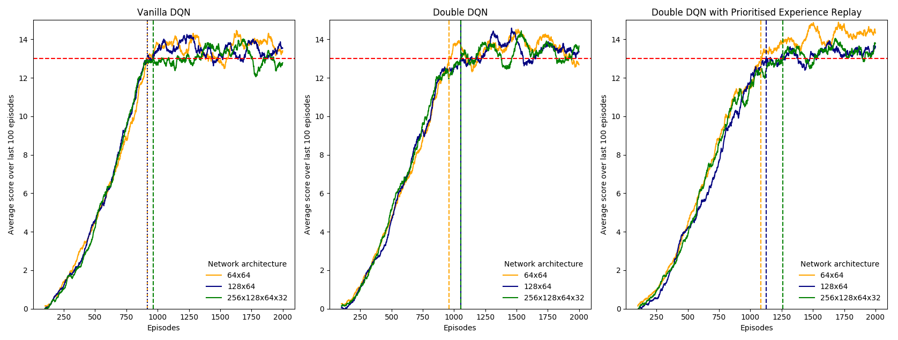

## Udacity Deep Reinforcement Learning Nanodegree 
## Project 1: Navigation

### Description of Implementation

The environment is solved using a deep Q-network (DQN) with fixed targets and experience replay. Training proceeds as follows:

1. The agent receives a state vector from the environment
1. Based on the current state, the agent chooses an action that is epsilon-greedy with respect to the local Q-network
1. The agent then receives the next state vector and a reward from the environment (as well as a termination signal that indicates if the episode is complete)
1. The experience tuple `(state, action, reward, next state)` is added to the replay buffer
1. Every fixed number of steps, a sample of experience tuples is drawn from the replay buffer (assuming it contains enough tuples)
1. The sample is used to update the weights of the local Q-network, which are in turn used to adjust the weights of the target Q-network using a soft-update rule
1. The state that was obtained in step (3) then becomes the current state and the process repeats from step (2)

#### Learning Algorithms

This project considers three variations of the deep Q-learning algorithm:

1. Vanilla DQN with fixed targets and experience replay
1. *Double* DQN with fixed targets and experience replay
1. *Double* DQN with fixed targets and *prioritised* experience replay

#### Agent Hyperparameters

##### All Deep Q-Networks

- `epsilon` controls the degree of exploration vs exploitation of the agent in selecting its actions. `epsilon = 0` implies that the agent is greedy with respect to the Q-network (pure exploitation) and `epsilon = 1` implies that the agent selects actions completely randomly (pure exploration). In this project, `epsilon` was initially annealed from 1.0 to 0.1 in steps of 0.001 after each episode, and remained fixed at 0.1 therafter. This was subsequently adapted to decay exponentially by a factor of 0.995 per episode from 1.0 to 0.01
- `GAMMA = 0.99` is the discount factor that controls how far-sighted the agent is with respect to rewards. `GAMMA = 0` implies that only the immediate reward is important and `GAMMA = 1.0` implies that all rewards are equally important, irrespective whether they are realised soon and much later
- `TAU = 0.001` controls the degree to which the target Q-network parameters are adjusted toward those of the local Q-network. `TAU = 0` implies no adjustment (the target Q-network does not ever learn) and `TAU = 1` implies that the target Q-network parameters are completelty replaced with the local Q-network parameters
- `LR = 0.0005` is the learning rate for the gradient descent update of the local Q-network weights
- `UPDATE_EVERY = 4` determines the number of sampling steps between rounds of learning (Q-network parameter updates)
- `BUFFER_SIZE = 10000` is the number of experience tuples `(state, action, reward, next_state, done)` that are stored in the replay buffer and avaiable for learning
- `BATCH_SIZE = 64` is the number of tuples that are sampled from the replay buffer for learning

##### Prioritised Experience Replay

- `e_priority = 0.01` is added to the absolute value of the TD error to ensure that none of the priorities are exactly zero. This ensures that all tuples in the replay buffer have a non-zero probability of being selected for training
- `a_priority` controls the extent to which the TD error influences the probability of selecting a tuple for training. `a_priority=0` implies that all tuples in the buffer have equal probability of selection, while `a_priority=1` implies pure priority (TD error-based) sampling. We set `a_priority = 0.6` as in [this paper](https://arxiv.org/pdf/1511.05952.pdf)
- `b_priority` controls the extent to which the biased sampling from the replay buffer is corrected in the gradient descent update. `b_priority = 0` implies no correction for bias and `b_priority = 1` implies complete bias correction. In this project, `b_priority` is increased from 0.4 to 1.0 in steps of 0.0005 after each episode, and remains fixed at 1.0 therafter (as done in [this paper](https://arxiv.org/pdf/1511.05952.pdf))

#### Model Architecture and Hyperparameters

The mapping from states to actions was modelled with a feedforward deep neural network with a 37-dimensonal input layer and a 4-dimensional output layer. The number of hidden layers, the number of neurons within each hidden layer and the activation functions applied to each layer are hyperparameters that must be selected. In this project, the ReLU activation function was used for all hidden layers and a linear activation function was applied to the output layer. Various network architectures were considered:

- 2 hidden layers with 64 neurons each
- 2 hidden layers with 128 neurons in the first layer and 68 neurons in the second layer
- 4 hidden layers with 256, 128, 64 and 32 neurons each (moving from the input layer to the ouput layer)

### Results

All agents were trained for 2000 episodes. The plots below show the average score obtained during training over the last 100 episodes for the DQN, double DQN and double DQN with prioritised experience replay algorithms, and for each of the three network architectures described above. The vertical lines indicate the number of episodes required for the average score to first equal or exceed 13.0.

The number of episodes required for the average score to first equal or exceed 13.0 and the maximum average observed over the 2000 training episodes are given in the table below (each cell reports episodes/max score).

| Architecture        | Vanilla DQN         | Double DQN          | Double DQN with PER |
| ------------------- | ------------------- | ------------------- | ------------------- |
| 64 x 64             | 919 /                | 958 /              | 1083 /              |
| 128 x 64            | 917 /                | 1055 /             | 1125 /              |
| 256 x 128 x 64 x 32 | 964 /                | 1056 /             | 1258 /              |

The results suggest that a vanilla DQN was a relatively small, fully-connected neural network (two hidden layers with 64 neurons each) is sufficient to train a successful agent. However, the mean score exhibits large fluctuations even after it has plateaued. This suggests that the agent is spending too much time exploring, rather than exploiting the learned Q-network. The results above were obtained by allowing epsilon to decrease linearly from 1.0 to 0.1 in steps of 0.001. To reduce the degree of exploration, we next considered an agent with an epsilon that decays exponentially by a factor of 0.995 from 1.0 all the way down to 0.01. The results are shown below for the smallest neural network.

### Future Plans for Improvement

The performance of the agent might be improved by considering the following:

- Hyperparameter optimisation 

  Many of the hyperparameters listed above were treated as fixed. These could be tuned to improve performance.

- Duelling DQN or other learning algorithms

  One could consider using a duelling DQN that predicts the state-value function *V(s)* and advantages *A(s,a)* of taking each action within a given state. One could also consider algorithms other than DQNs. 

Further work is also required to optimise the code for training. In particular, the current implementation of prioritised replay is very slow and additional work is required to make this more computationally efficient.
